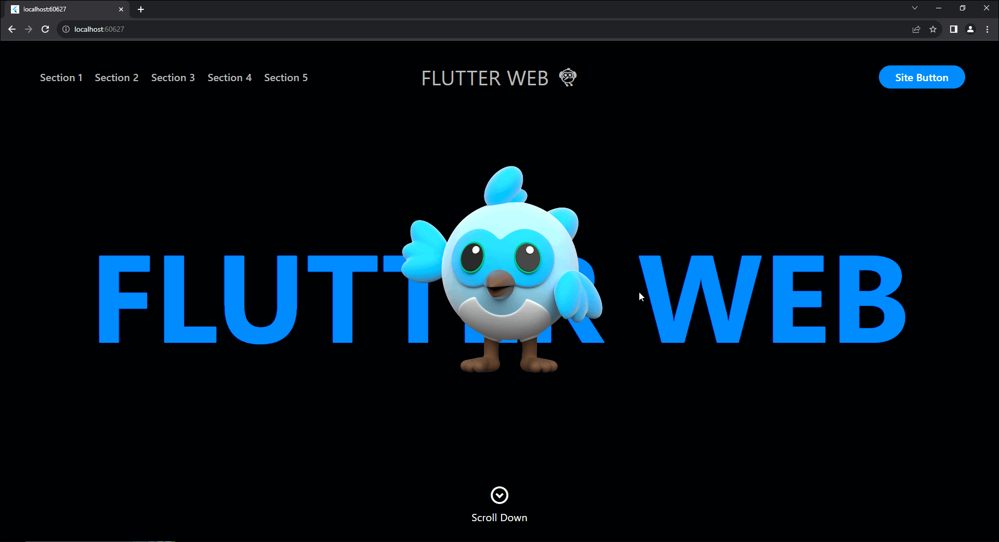

# single_web_page

Create Single Web Page Layout with easy and optimized scrolling options in Flutter.

## How it Looks
What does the code in the [example](https://pub.dev/packages/single_web_page/example) look like;

[](https://single-web-page-test.web.app)

## How to use

```
class HowToUseSingleWebPage extends StatefulWidget {
  const HowToUseSingleWebPage({super.key});

  @override
  State<HowToUseSingleWebPage> createState() => _HowToUseSingleWebPageState();
}

class _HowToUseSingleWebPageState extends State<HowToUseSingleWebPage> {
  late final SingleWebPageController _controller;

  @override
  void initState() {
    _controller = SingleWebPageController(
      //Specify snap for each index (default topSnap)
      snaps: [Snap.topSnap, Snap.centerSnap, Snap.bottomSnap],
      //Specify extra offset for topSnaps
      topSnapExtraOffset: 0,
      //Specify extra offset for centerSnaps
      centerSnapExtraOffset: 0,
      //Specify extra offset for bottomSnaps
      bottomSnapExtraOffset: 0,
      onAnimatedScrollStart: (currentIndex, targetIndex) {
        //Listen index on animated scroll start
      },
      onAnimatedScrollEnd: (currentIndex) {
        //Listen index on animated scroll end
      },
      onScrollEnd: (lastVisibleIndex) {
        //Listen last visible index on (non-animated) scroll end
      },
      //If the user wants to animate same index, this will trigger the animation effect.
      triggerSameIndexAnimationEffect: true
    );
    super.initState();
  }

  @override
  Widget build(BuildContext context) {
    return SingleWebPage(
      //Provide controller
      controller: _controller,
      //Specify physics. You can implement adaptive versions if you want
      singleWebPagePhysics: SingleWebPagePhysics.stepByStep,
      //Specify sliverAppBar if you want
      sliverAppBar: null,
      //Specify sections
      sections: [
        Container(
          height: MediaQuery.of(context).size.height,
          alignment: Alignment.center,
          child: Column(
            mainAxisSize: MainAxisSize.min,
            children: [
              const Text("Section 1"),
              ElevatedButton(
                //Animate to index easily (Provided snap is applied)
                onPressed: () => _controller.animateToSectionIndex(1),
                child: const Text("To Section 2"),
              ),
              ElevatedButton(
                onPressed: () => _controller.animateToSectionIndex(2),
                child: const Text("To Section 3"),
              )
            ],
          ),
        ),
        Container(
          height: MediaQuery.of(context).size.height / 2,
          color: Colors.grey,
          alignment: Alignment.center,
          child: const Text("Section 2"),
        ),
        Container(
          height: MediaQuery.of(context).size.height / 2,
          alignment: Alignment.center,
          child: Column(
            mainAxisSize: MainAxisSize.min,
            children: [
              const Text("Section 3"),
              ElevatedButton(
                onPressed: () => _controller.animateToSectionIndex(0),
                child: const Text("To Top"),
              )
            ],
          ),
        ),
      ],
    );
  }
}
```

## Note
Please keep this in mind when using this library. While creating this library, I never tried it on platforms other than the web.
